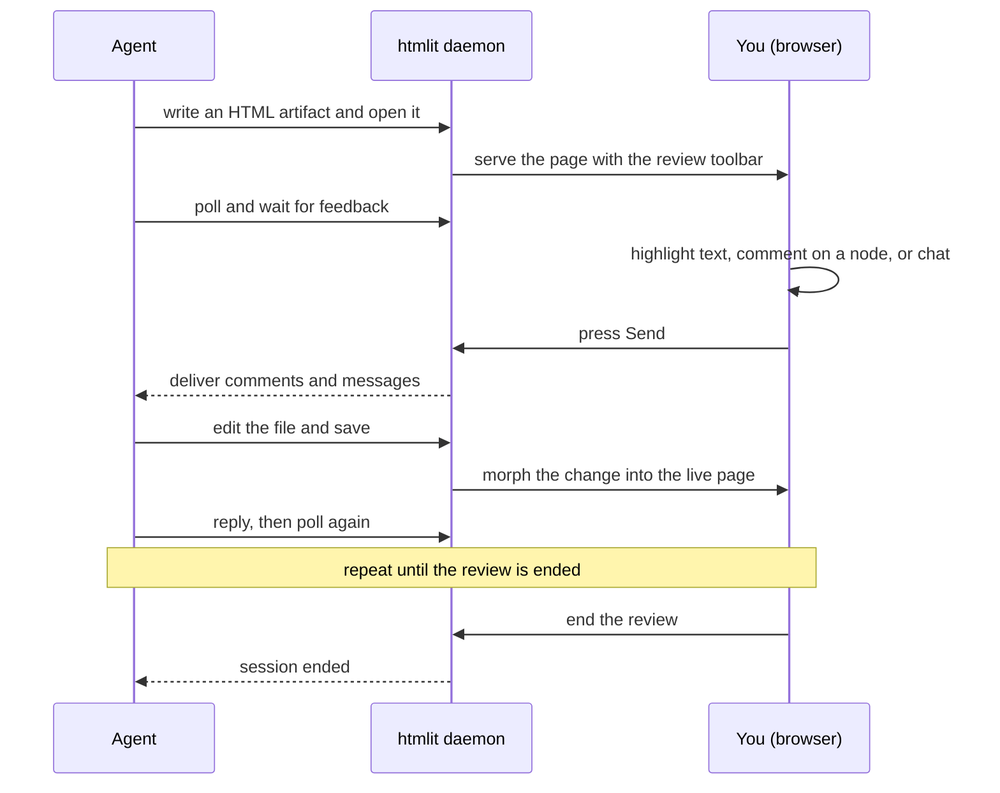

# htmlit

[](https://github.com/auspham/htmlit/actions/workflows/ci.yml)
[](./LICENSE)
[](https://skills.sh/auspham/htmlit)

htmlit turns an agent's plain-text plan, research, or reply into an interactive page you can read, highlight, comment on, and question in place. The agent applies your feedback live, so you review properly instead of skimming a terminal dump.


> [!IMPORTANT]
> **Everything runs locally - no cloud, accounts, or telemetry.** You need **Python 3.8+ and a browser**. The daemon is a single Python standard-library HTTP server (no `pip install`, no Node) bound to `127.0.0.1`, so your artifacts, comments, and conversation never leave your machine.

Packaged as an [agent skill](https://skills.sh/), so any supported agent installs it in one command.

## Why

Agents produce a lot of text, and skimming it is where quality leaks: you miss a risky assumption, wave through a diff you never read, or approve the wrong tradeoff, and the agent carries that mistake forward.

htmlit makes careful review the easy path. Instead of a terminal wall, the agent hands over a real page: rendered Mermaid diagrams, highlighted code, tables, and Google-Docs-style comments. Highlight the line you doubt, ask about it in place, and the agent answers inline. Your feedback goes back to the agent, it edits the file, and the page updates in place with no reload.

## How it works

A small daemon sits between the agent and your browser. The agent writes and serves a normal HTML file, you review it, and your feedback flows back so the agent edits the file and the page updates in place. It repeats in one tab until you end the review.



## Install

Install the skill into your agent with the [Skills CLI](https://github.com/vercel-labs/skills):

```bash
npx skills add auspham/htmlit
```

Common variants:

```bash
# Install globally (available across all your projects)
npx skills add auspham/htmlit -g

# Install for a specific agent
npx skills add auspham/htmlit -a claude-code

# Preview without installing
npx skills add auspham/htmlit --list
```

Once installed, the agent gains an `htmlit` command and a `/htmlit` invocation. See [`skills/htmlit/SKILL.md`](./skills/htmlit/SKILL.md) for the full agent-facing instructions.

## Prerequisites

You need Python and a browser:

- **Python 3.8 or newer.** The daemon and CLI are standard-library only, so there is nothing to `pip install`.
- **A web browser** to open the review surface.

On first use these load from a CDN while the daemon downloads them locally in the background, so later loads are served from disk. Run `htmlit vendor` to fetch them up front, or set `HTMLIT_AUTO_VENDOR=0` to keep using the CDN. Node.js is only for the browser test suite when developing htmlit, never to use the skill.

## Quickstart

Everything runs through the `htmlit` command. A typical session:

```bash
# 1. The agent writes an artifact, by default under ~/.htmlit
#    (so a generated review never pollutes a project's git status).

# 2. Open it. This spawns the daemon on demand and prints the URL and session key.
htmlit ~/.htmlit/plan.html

# 3. Serve it: long-poll for the human's annotations and messages.
htmlit poll ~/.htmlit/plan.html

# 4. Apply feedback by editing the file and saving; the page morphs live.
#    Reply and keep polling:
htmlit poll ~/.htmlit/plan.html --agent-reply "Done, enlarged the title."

# 5. End the review (a generated artifact is cleaned up automatically).
htmlit end ~/.htmlit/plan.html
```

The agent that opens a review serves it, staying in the poll loop until you end the session. A presence indicator shows whether an agent is connected.

## Features

- **Self-reload via DOM morphing.** Edit the artifact and save; the page patches in place with [Idiomorph](https://github.com/bigskysoftware/idiomorph). Scroll position, form state, rendered diagrams, and the toolbar all survive - no iframe, no flash, no full reload.
- **Google-Docs-style annotation.** Select any text to leave a local highlight or a comment for the agent. Comments sit in a card rail down the right margin, each anchored to what it marks, with reply threads.
- **Shadow-DOM toolbar.** The review chrome lives in a shadow root, so the artifact's CSS and the toolbar's styles never touch each other.
- **Rendered Mermaid and code.** Mermaid blocks render into a pannable, zoomable canvas you can rearrange by dragging nodes and edges. Code blocks are highlighted by highlight.js with a language header and line-number gutter.
- **Light and dark themes.** One toggle flips the artifact, the diagrams, and the code theme together.
- **Resumable, with agent handoff.** A kept review persists its conversation and a handoff note beside the artifact, so you can resume later or hand off to another agent that continues where the last one left off.
- **Shareable reports.** The artifact is a plain HTML file, and a one-click Export produces a standalone HTML report or a PDF with your highlights baked in, so you can share a review without teammates running htmlit.
- **No CDN latency, offline capable.** On first use, assets load from the CDN while the daemon caches them locally in parallel, so every later load is served from disk with no round-trip. Set `HTMLIT_AUTO_VENDOR=0` to keep using the CDN.

## What the tab favicon means

The tab favicon reflects the live review state, so you can tell at a glance whether it is your turn to act and whether an agent is still connected.

| Favicon | State | What it means |
| :---: | --- | --- |
|  | Waiting | No agent is connected to the review. |
|  | Listening | An agent is connected and waiting for your input. |
|  | Working | An agent is processing the feedback you sent. |
|  | Ended | The review has ended. |

The listening and working icons animate while an agent is active.

## Under the hood

- **One daemon, many sessions.** The daemon is spawned on demand and registered at `~/.htmlit/server.json`. Sessions are keyed by the artifact's absolute path, so many reviews can run at once.
- **Single-document injection.** The daemon serves your HTML unchanged except for a small client script inserted before `</body>`. The artifact still opens on its own; the toolbar appears only when served.
- **Change feed.** The client opens a server-sent-events stream. When the file changes on disk, the daemon broadcasts a reload event and the client morphs the new DOM into the page.
- **Feedback queue.** Annotations and messages queue on the server until the agent long-polls for them, so nothing is lost while the agent is busy.

The vendored front-end assets are not committed to this repository. On first serve the daemon downloads any that are missing in the background (disable with `HTMLIT_AUTO_VENDOR=0`), so later loads are local. `htmlit vendor` fetches them up front.

## The `htmlit` command

| Command | What it does |
| --- | --- |
| `htmlit <file.html>` | Open or resume a review and launch the browser. |
| `htmlit poll <file.html>` | Long-poll for annotations, messages, and layout warnings. |
| `htmlit poll <file> --agent-reply "msg"` | Post an agent message, then poll. |
| `htmlit reply <file> "msg"` | Post an agent message without polling. |
| `htmlit context <file> "note"` | Save a handoff note for a future agent that resumes the review. |
| `htmlit resume` | List resumable reviews, or resume one. |
| `htmlit end <file>` | End the session (a generated artifact is deleted; pass `--keep` to retain it). |
| `htmlit stop` | Shut the daemon down. |
| `htmlit vendor [--force]` | Download the local Mermaid, highlight.js, and Idiomorph assets. |

## Development

Contributions are welcome. See [CONTRIBUTING.md](./CONTRIBUTING.md) for how to set up the toolchain and run the tests.

```bash
# Python tests and lint
python -m pytest tests/python
ruff check skills/htmlit tests/python

# Browser client tests (needs Node and a browser)
npm ci
npm test
```

## Repository layout

```
skills/htmlit/        The installable skill (SKILL.md plus the daemon, CLI, and client)
  htmlit              Launcher on PATH once installed
  htmlit_cli.py       CLI entry point (delegates to htmlit_core.cli)
  htmlit_server.py    Daemon entry point (delegates to htmlit_core.server)
  htmlit_core/        The implementation, split by concern:
    enums.py            State-machine enumerations
    models.py           Typed shapes for the wire and sidecar JSON
    config.py           Paths, tunables, key and version helpers
    sidecar.py          Persistence next to the artifact
    session.py          In-memory review state (Session, Hub)
    page.py             The injected page and its config
    server.py           HTTP handler and daemon loop
    cli.py              Command-line commands
    vendoring.py        Parallel, atomic download of the vendored assets
  client/             The injected browser client (native ES modules + client.css)
  vendor.py           Fetches the vendored front-end assets (delegates to vendoring)
tests/python/         Pytest suite for the daemon and CLI
tests/client/         Browser tests for the Mermaid rearrange client
```

## License

[MIT](./LICENSE) © auspham

Mermaid, highlight.js, and Idiomorph are vendored at runtime under their own respective licenses and are not redistributed in this repository.
